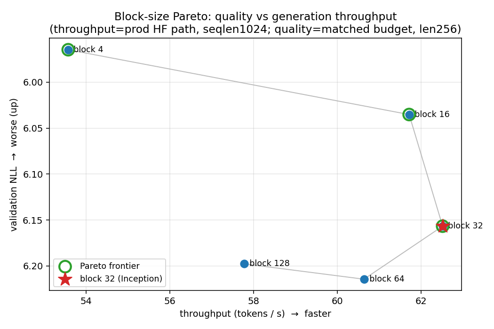
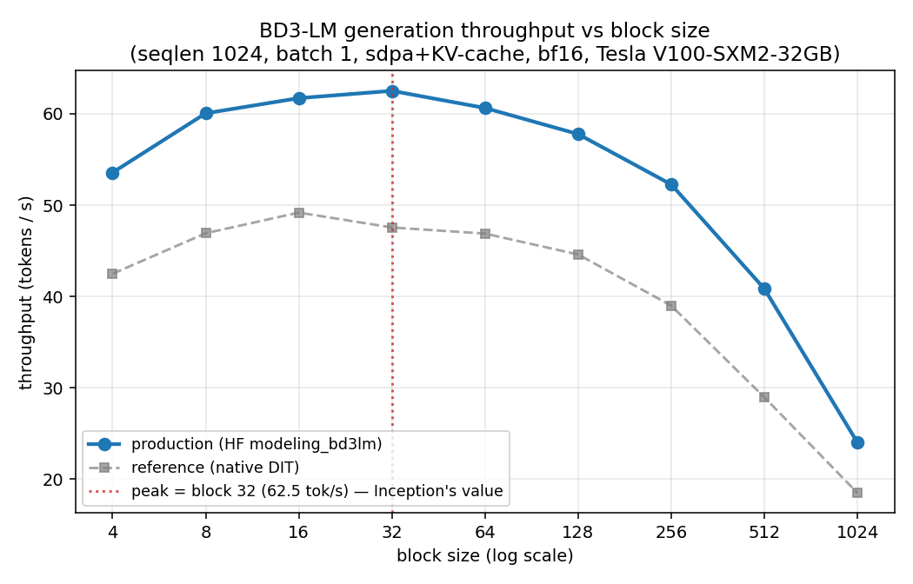
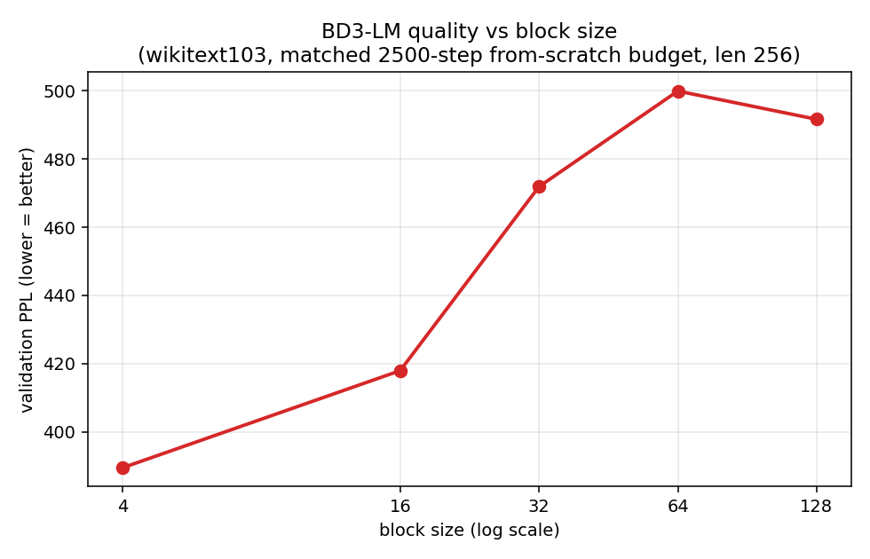

# Block-Size Pareto Frontier for Block-Diffusion LMs

> **Why does Inception Labs' Mercury run block size 32?**
> Block-Diffusion LMs (BD3-LMs) interpolate between autoregressive and diffusion
> models via a **block size** knob. Public checkpoints cover only 4/8/16; Stefano
> Ermon said in person that Mercury runs **32**. This repo measures the full
> **quality ↔ efficiency frontier** on commodity GPUs to explain why — every
> number from a real run.

**TL;DR:** On the production code path, generation throughput **peaks at block size 32**.
Quality degrades monotonically as blocks grow. On the quality-vs-throughput Pareto, the
non-dominated set is **{4, 16, 32}**, and **block 32 is the throughput-optimal endpoint** —
blocks 64/128 are strictly dominated. Picking 32 = choosing the fastest point on the
frontier at a small, bounded quality cost. Full writeup: **[FINDINGS.md](FINDINGS.md)**.



---

## Headline results

| | |
|---|---|
| **Pipeline validated** | Reproduced released BD3-LM block-16 OWT perplexity to ~0.1% (**22.30** vs paper **≤22.27**) |
| **Throughput peaks at block 32** | 62.5 tok/s on the production HF path; non-monotonic (see below) |
| **Quality** | Monotonically worsens with block size (4→32), plateaus at 64/128 |
| **Pareto frontier** | **{4, 16, 32}** — 64/128 strictly dominated by 32 |
| **Weight-independence** | random-init vs real-checkpoint throughput match to **0.03%** ⇒ unreleased 32/64/128 points are faithful |

### Generation throughput vs block size (production HF path, V100, seqlen 1024, batch 1)


Small blocks pay per-stride loop + KV-store overhead; large blocks pay expensive
per-step attention. NFE is constant (first_hitting ⇒ ~1 token/step). Memory rises
monotonically with block size (`results/phase2_memory.png`).

### Quality vs block size (wikitext103, matched 2500-step from-scratch budget)


Smaller blocks are closer to autoregressive ⇒ better likelihood. _(Scope: this is
quality under a matched **cheap** budget — the block-size **ordering** is the claim,
not converged absolute PPL. See caveats in [FINDINGS.md](FINDINGS.md).)_

---

## Repository layout
```
README.md       this file — front door + results
FINDINGS.md     the writeup: question, setup, results, Pareto, honest caveats
SPEC.md         blueprint: phases, hypotheses, methodology, compute budget, decision gates
LOG.md          running engineering/devops log (newest on top)
CONTRIBUTING.md commit-message convention
UPSTREAM.md     pinned bd3lms commit SHA (upstream is NOT vendored)

env/            conda env build (SLURM) + locked requirements (requirements.lock.txt)
exp/            SLURM batch jobs:
                  p1_prep_owt.sbatch       OWT download/cache (CPU)
                  p1_ppl_owt.sbatch        PPL reproduction (Phase 1)
                  p2_efficiency.sbatch     throughput/memory/NFE sweep (Phase 2)
                  p3_train_probe.sbatch    training step-timing probe
                  p3_quality_sweep.sbatch  quality sweep, one block size/job (Phase 3)
bench/          bench_gen.py       generation-efficiency harness
analysis/       analyze_phase2.py  efficiency CSV + plots
                analyze_pareto.py  combined quality↔throughput Pareto
results/        committed metrics (CSV/JSON) + figures (PNG)
```

## Method at a glance
- **Upstream** [kuleshov-group/bd3lms](https://github.com/kuleshov-group/bd3lms) (ICLR 2025), pinned by SHA in [UPSTREAM.md](UPSTREAM.md) — cloned on the cluster, never vendored.
- **Efficiency** measured on the production HF `modeling_bd3lm` path (random init, validated equivalent to real checkpoints) ⇒ the unreleased 32/64/128 are measurable.
- **Quality** from controlled matched-budget training on wikitext103.
- **Env:** torch 2.7.1+cu126, py3.9; `sdpa` + KV-cache at inference (flex needs Ampere+).

## Infra & workflow (git is the spine)
- **Cluster:** Northeastern Explorer — `gpu` (H200/A100, 8h), `gpu-short` (2h), `sharing`/`short` (CPU).
- **GitHub** `BrutalCaeser/block-diffusion-pareto` (public) = source of truth. Author + commit
  locally → `git push` → cluster `git pull` to run. Large artifacts stay on `/scratch`
  (gitignored); small results (CSV/JSON/PNG) are committed.

## Reproduce
```bash
ssh explorer
cd /scratch/gupta.yashv/block-pareto/repo && git pull
sbatch env/build_blockpareto_env.sbatch                              # 1. env (Gate G0)
sbatch exp/p1_prep_owt.sbatch                                        # 2. cache OWT valid
sbatch --partition=gpu --time=04:00:00 --export=ALL,BS=16 exp/p1_ppl_owt.sbatch   # 3. PPL (Gate G1)
sbatch --export=ALL,BACKEND=hf_random,BLOCKS="4 8 16 32 64 128" exp/p2_efficiency.sbatch  # 4. throughput
for BS in 4 16 32 64 128; do sbatch --export=ALL,BS=$BS exp/p3_quality_sweep.sbatch; done # 5. quality
python analysis/analyze_phase2.py && python analysis/analyze_pareto.py             # 6. figures
```

## Status: complete (Phases 0–4)
Env ✓ · PPL reproduction ✓ · efficiency sweep ✓ · quality sweep ✓ · Pareto + writeup ✓.
See [LOG.md](LOG.md) for the full run-by-run history. Possible extensions: finetune-from-pretrain
quality sweep (converged absolutes), batch/seqlen throughput sweeps, blog post.
